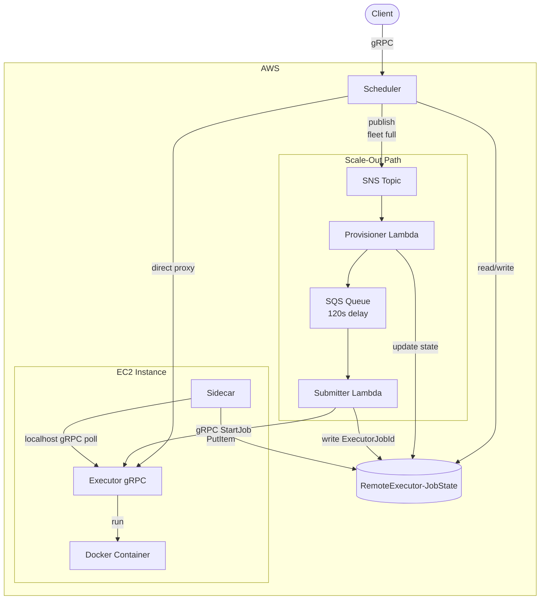

# Remote Executor

A distributed system for executing shell commands inside Docker containers on
remote EC2 instances. Clients submit jobs via gRPC and the platform handles
scheduling, fleet management, and auto-scaling transparently.

## Architecture



### Modules

The project is a Gradle multi-module build targeting Java 21.

| Module | Description |
| :--- | :--- |
| **common** | Shared Protobuf/gRPC contract (`shell.proto`) and SSM-backed `Config` helper. All other modules depend on this. |
| **executor** | gRPC server that runs shell commands in Docker containers. Tracks jobs in memory. Deployed as a systemd service on EC2. |
| **sidecar** | Daemon co-located with the executor. Polls the executor over localhost gRPC, persists job state to DynamoDB, and manages instance lifecycle. |
| **scheduler** | Control plane. Exposes the same gRPC contract as the executor, acting as a reverse proxy and load balancer. Routes jobs to available instances and triggers scale-out when the fleet is full. |
| **scale-out** | Two AWS Lambda functions (`ProvisionHandler`, `SubmitHandler`) that handle asynchronous EC2 provisioning when no existing instance has capacity. |

### Job Lifecycle

1. A client calls `StartJob` on the **scheduler**.
2. The scheduler queries the DynamoDB `ActiveInstancesIndex` GSI to find an
   executor instance with capacity below `MAX_RUNNING_JOBS_PER_INSTANCE`.
3. **If capacity exists:** the scheduler opens a gRPC channel to the executor
   and proxies the request directly. The client gets back a job ID immediately.
4. **If the fleet is full:** the scheduler writes a `SCHEDULED` state to
   DynamoDB, publishes the command payload to SNS, and returns a job ID to the
   client. From there:
   - The **Provisioner** Lambda launches a new EC2 instance from a launch
     template, updates the job state to `PROVISIONING`, and enqueues the
     payload to SQS with a 120-second delay.
   - The **Submitter** Lambda resolves the new instance's IP, forwards
     `StartJob` to the executor, and writes the executor's internal job ID
     back to DynamoDB as `ExecutorJobId`.
5. On the EC2 instance, the **executor** runs the command inside an
   `alpine:latest` Docker container.
6. The **sidecar** polls the executor, detects state changes (running,
   completed, system error), and persists them to DynamoDB.
7. The client can call `GetJobStatus` or `WatchJobLogs` on the scheduler at
   any time. The scheduler reads completed state from DynamoDB and proxies live
   log streams to the executor for running jobs.

### Scale-Out

Scale-out is centralized in the scheduler. When all instances are at capacity,
the scheduler initiates the asynchronous provisioning path described above (SNS
-> Provisioner Lambda -> SQS -> Submitter Lambda). The new instance boots from
a pre-baked AMI that already contains the executor and sidecar binaries, and
is ready to accept jobs within roughly two minutes.

### Scale-In (Not Yet Implemented)

Scale-in is designed to be fully decentralized. Each sidecar independently
tracks how long its executor has been idle (no running jobs). Once the idle
duration exceeds a configurable threshold, the sidecar self-terminates its own
EC2 instance via the AWS EC2 API (IMDSv2 is used to discover the instance ID).

To complement this, the scheduler should only index instances that have recently
reported activity. By filtering the DynamoDB GSI for items with an `UpdatedAt`
timestamp below the same inactivity threshold, the scheduler avoids routing
jobs to instances that are about to terminate themselves. This creates a
protocol where instances silently leave the fleet and the scheduler naturally
stops considering them, without any explicit deregistration step.

## gRPC API

The contract is defined in `common/src/main/proto/shell.proto`.

| RPC | Type | Description |
| :--- | :--- | :--- |
| `StartJob` | Unary | Submit a command for execution. Returns a job ID. |
| `GetJobStatus` | Unary | Query the current state of a job (running, completed, or system error). |
| `WatchJobLogs` | Server streaming | Stream stdout/stderr from a running container in real time. |
| `ListJobs` | Unary | List all tracked job IDs. |

## Infrastructure

CloudFormation templates live in `iac/`.

| Template | Resources |
| :--- | :--- |
| `dynamodb.yaml` | `RemoteExecutor-JobState` table with `ActiveInstancesIndex` GSI. |
| `executor.yaml` | IAM role, instance profile, and security group for executor EC2 instances. |
| `pipeline.yaml` | CI/CD pipeline for the executor and sidecar: CodePipeline, CodeBuild, and a layered EC2 Image Builder chain (executor AMI -> sidecar AMI). |
| `scheduler.yaml` | SNS topic, SQS queue (with DLQ), and the two scale-out Lambda functions. |
| `scheduler-pipeline.yaml` | CI/CD pipeline for the scheduler and scale-out modules: CodePipeline, CodeBuild, Image Builder, and a Lambda publisher that auto-deploys new function code. |

AMIs are built in layers: the executor pipeline produces a base AMI, then the
sidecar pipeline extends it. An EventBridge rule triggers the sidecar build
automatically when the executor AMI becomes available.

## Building

```sh
./gradlew build
```

Individual modules:

```sh
./gradlew :executor:build
./gradlew :sidecar:build
./gradlew :scheduler:build
./gradlew :scale-out:build
```

The scale-out module produces a fat JAR (via Shadow) with merged gRPC service
files, ready for Lambda deployment.

## Deploying

The `scripts/bootstrap-aws-account.sh` script deploys all CloudFormation stacks:

```sh
./scripts/bootstrap-aws-account.sh <ACCOUNT_ID> <REGION>
```

Individual stacks can be deployed by name (e.g. `dynamodb`, `executor`,
`pipeline`, `scheduler`, `scheduler-pipeline`).

CI/CD pipelines pull from the GitHub repository via a CodeStar connection and
build/deploy automatically on push.

## Testing the Executor

The `scripts/test-executor.sh` script exercises the executor's gRPC API using
`grpcurl`:

```sh
./scripts/test-executor.sh [HOST:PORT]
```

Set the `API_KEY` environment variable if the executor has auth enabled.

## License

MIT
